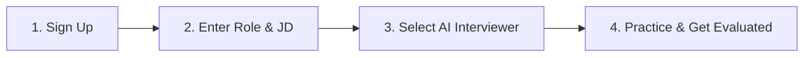

# 🎙️ Zavran AI
### Next-Generation AI Interview Preparation & Simulation Platform

  <b>Master your dream job interviews with real-time, adaptive AI interviewers tailored to your exact role and job description.</b>

---

## 🌟 Overview

**Zavran AI** is an advanced, AI-powered interview preparation platform exclusively designed to simulate realistic, high-stakes technical, behavioral, and executive interviews. By pairing dynamic question generation with natural voice-driven AI interviewers, Zavran AI bridges the gap between practice and real-world hiring standards.

---

## 🚀 How It Works

Getting interview-ready with Zavran AI takes just 4 simple steps:

### 1. 👤 Quick Sign Up
Create your candidate profile in seconds and access a personalized preparation dashboard.

### 2. 🎯 Enter Target Role & Job Description (JD)
- Paste your target job title, seniorities, or paste full Job Descriptions (JDs).
- Upload your resume to enable tailored questions aligned with your actual experience.

### 3. 🤖 Choose Your AI Interviewer
Select from distinct AI interviewer personas engineered for different interview styles and domains:
- **Zaroon** — Deep technical architecture, coding depth & system design rigor.
- **Executive Boardroom** — Leadership, strategic decision-making & behavioral acumen.
- **Domain Specialists** — Tailored expertise across Software Engineering, Product Management, Data Science, Finance, and more.

### 4. 📈 Interactive Interview & Instant Evaluation
- **Adaptive Dialogue**: Questions evolve dynamically based on the depth and accuracy of your answers.
- **Ultra-Low Latency Voice**: Speak naturally and hear human-like AI responses in real time.
- **Actionable Report**: Receive a comprehensive post-interview breakdown with readiness scores, skill strengths, and areas for improvement.

---

## ✨ Key Features

- **🎯 Role-Specific Adaptability**: Powered by an extensive catalog of roles and curated question banks for precision prep.
- **🗣️ Natural Voice & Audio Engine**: Real-time speech recognition (STT) and synthesized voice output (TTS) with Zaroon Voice.
- **🧠 Multi-Provider LLM Orchestration**: Supports industry-leading AI models (OpenAI, Anthropic Claude, Google Gemini, Groq, Kimi, and HuggingFace).
- **📊 Comprehensive Performance Scorecards**: Detailed rubrics covering technical accuracy, communication clarity, problem-solving structure, and executive presence.
- **🔒 Enterprise & Candidate Workspaces**: Isolated environments supporting both individual candidate practice and enterprise hiring workflows.

---

## 🛠️ Technology Stack

- **Backend**: FastAPI, Python 3.10+, SQLite / Supabase, Pydantic
- **Frontend**: Modern HTML5 / TailwindCSS / Vanilla JS & React Components
- **AI / LLM Providers**: OpenAI GPT, Anthropic Claude, Google Gemini, Groq, Kimi, Hugging Face
- **Audio & Voice**: Real-time STT / TTS pipelines with custom voice profiles
- **Auth & Storage**: Clerk Authentication, Supabase / SQLite persistent store

---

## 📄 License

This project is licensed under the [MIT License](LICENSE).